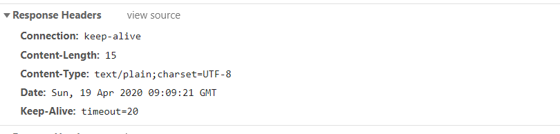
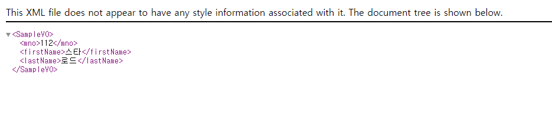
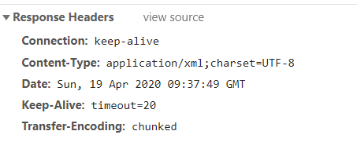

# Rest방식
   
> Rest(Representational State Transfer)   
하나의 URI는 하나의 고유한 리소스를 대표하도록 설계된다.
   
URI + GET/POST/PUT/DELETE/....   
   
오늘은 spring에서 사용하는 @RestController나 @ResponseBody같이 REST 방식 데이터 처리를 위한 어노테이션과 기능을 알아보자   

## 어노테이션과 기능   
1. @RestController : Controller가 REST방식을 처리하기 위함을 명시   
2. @ResponseBody : 일반적인 jsp와 같은 뷰로 전달되는 것이 아닌 데이터 자체를 전달하는 용도   
3. @PathVarialbe : URL 경로에 있는 값을 파라미터로 추출하려고 할 때 사용   
4. @CrossOrigin : Ajax의 크로스 도메인 문제를 해결해주는 어노테이션   
5. @RequestBody : JSON 데이터를 원하는 타입으로 바인딩 처리   
   
### @RestController
>   jsp와 달리 순수한 데이터를 반환하는 형태   
문자열이나 json, xml 사용
   
1. 문자열반환      
```java
//produces의 속성값은 MIME TYPE의 종류
@GetMapping(value="/getText", produces ="text/plain; charset=UTF-8")
public String getText(){
	return "안녕하세요";
}

```
screenshot   
   
   
2. 객체의 반환   
```java

@Data
@AllArgsConstructor
@NoArgsConstructor
public class SampleVO {
	private Integer mno;
	private String firstName;
	private String lastName;
}
```
Lombok 어노테이션 설명추가      
* AllArgsConstructor : 비어있는 생성자 자동생성
* NoArgsConstructor : 모든 속성 사용하는 생성자 자동생성   
   
```java
@GetMapping(value="/getSample",
	produces = {MediaType.APPLICATION_JSON_UTF8_VALUE,
				MediaType.APPLICATION_XML_VALUE})
	public SampleVO getSample(){
		return new SampleVO(112, "스타", "로드");
	}
```   
screenshot   
   
   