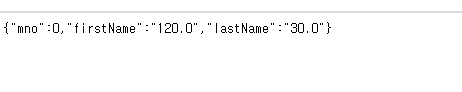

# Rest방식
   
> Rest(Representational State Transfer)   
하나의 URI는 하나의 고유한 리소스를 대표하도록 설계된다.
   
URI + GET/POST/PUT/DELETE/....   
   
오늘은 spring에서 사용하는 @RestController나 @ResponseBody같이 REST 방식 데이터 처리를 위한 어노테이션과 기능을 알아보자   

## 어노테이션과 기능   
1. @RestController : Controller가 REST방식을 처리하기 위함을 명시   
2. @ResponseBody : 일반적인 jsp와 같은 뷰로 전달되는 것이 아닌 데이터 자체를 전달하는 용도   
3. @PathVarialbe : URL 경로에 있는 값을 파라미터로 추출하려고 할 때 사용   
4. @CrossOrigin : Ajax의 크로스 도메인 문제를 해결해주는 어노테이션   
5. @RequestBody : JSON 데이터를 원하는 타입으로 바인딩 처리   
   
     
### @RestController
>   jsp와 달리 순수한 데이터를 반환하는 형태   
문자열이나 json, xml 사용
   
#### 1.문자열반환      
```java
//produces의 속성값은 MIME TYPE의 종류
@GetMapping(value="/getText", produces ="text/plain; charset=UTF-8")
public String getText(){
	return "안녕하세요";
}

```
screenshot   
   
   
    
#### 2.객체의 반환   
```java

@Data
@AllArgsConstructor
@NoArgsConstructor
public class SampleVO {
	private Integer mno;
	private String firstName;
	private String lastName;
}
```
   
* Lombok 어노테이션 설명추가      
- AllArgsConstructor : 비어있는 생성자 자동생성
- NoArgsConstructor : 모든 속성 사용하는 생성자 자동생성   
   
```java
@GetMapping(value="/getSample",
	produces = {MediaType.APPLICATION_JSON_UTF8_VALUE,
				MediaType.APPLICATION_XML_VALUE})
	public SampleVO getSample(){
		return new SampleVO(112, "스타", "로드");
	}
```   
      
   
   
   
   
#### 3.컬렉션 타입의 객체반환   
```java
// 1부터 10까지 루프처리
@GetMapping(value="/getList")
public List<SampleDAO> getList(){
	return IntStream.range(1,10).mapToObj(i -> new SampleVO(i, i+"First", i+ " Last")
	.collect(Collector.toList());
}
```
   
* 브라우저를 통해 /sample/getList 한 경우   
     
    
* 브라우저를 통해 /sample/getList.json 한 경우   
     	
     
	
#### 4.ResponseEntity 타입	
```java
//데이터와 함께 HTTP 헤더 상태메시지등을 같이 전달하는 용도
	@GetMapping(value = "/check", params = {"height", "weight"})
	public ResponseEntity<SampleVO> check(Double height, Double weight){
		SampleVO vo = new SampleVO(0, ""+height, ""+weight);
		
		ResponseEntity<SampleVO> result = null;
		
		if(height < 150) {
			result = ResponseEntity.status(HttpStatus.BAD_GATEWAY).body(vo);
		}else {
			result = ResponseEntity.status(HttpStatus.OK).body(vo);
		}
		
		return result;
	}
```	
   
* height 120을 넘기면 데이터와 502 메시지가 전송된다.   
   

   
   
    
    
###  @RestController의 파라미터
> @Controller에서 사용하던 타입이나 사용자가 정의한 타입을 사용한다. 여기에 추가로 몇가지 어노테이션을 사용한다.   

#### 1.@PathVariable   
> URL자체에 데이터를 식별할 수 있는 정보들을 표현하는 경우가 많으므로 경로의 일부를 파라미터로 사용   
   
```java
@GetMapping("/product/{cat}/{pid}")
public String[] getPath(@PathVariable("cat") String cat, @PathVariable("pid") Integer pid){
	return new String[] { "category: "+cat, "productid:"+pid}
}   
```   
   
* /sample/product/dogs/1 입력한 경우    
   
     
   
#### 2.@RequestBody  
> 전달된 요청의 내용을 이용해서 해당 파라미터의 타입으로 변환을 요구   
    
```java	
@PostMapping("/ticket")
	public Ticket convert(@RequestBody Ticket ticket) {
		return ticket;
	}
```	